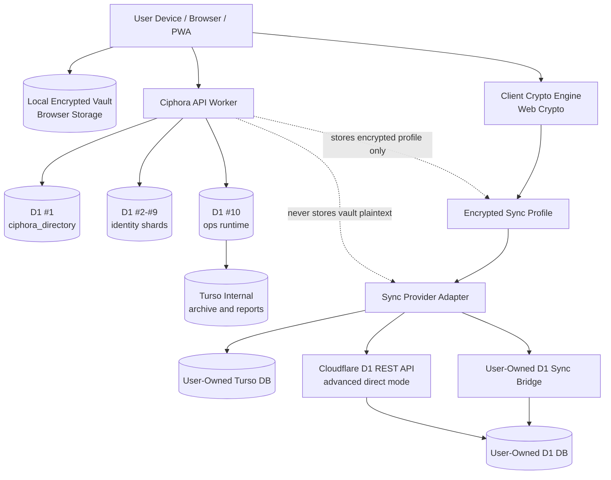
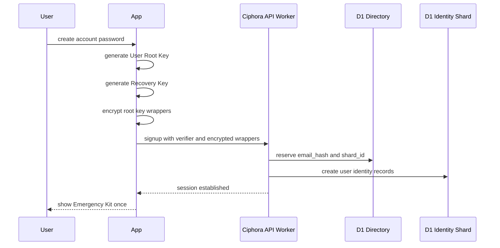
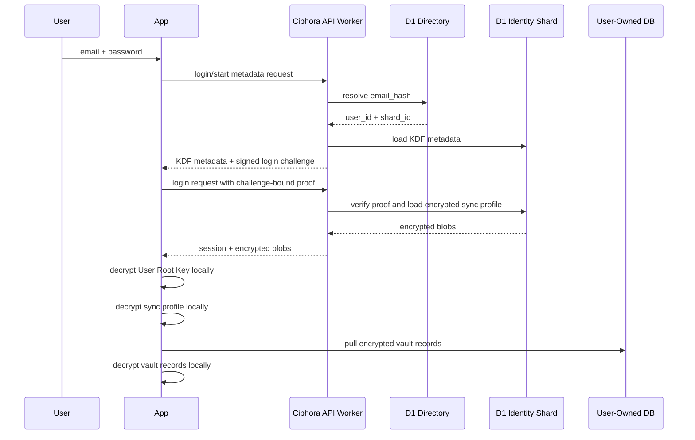
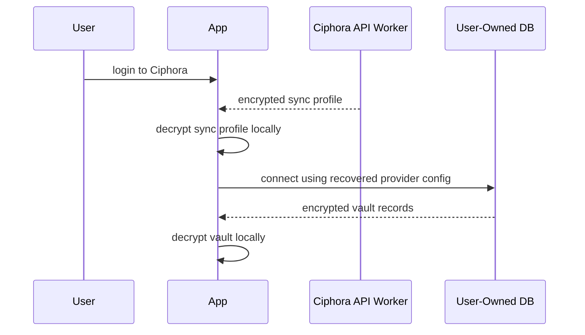
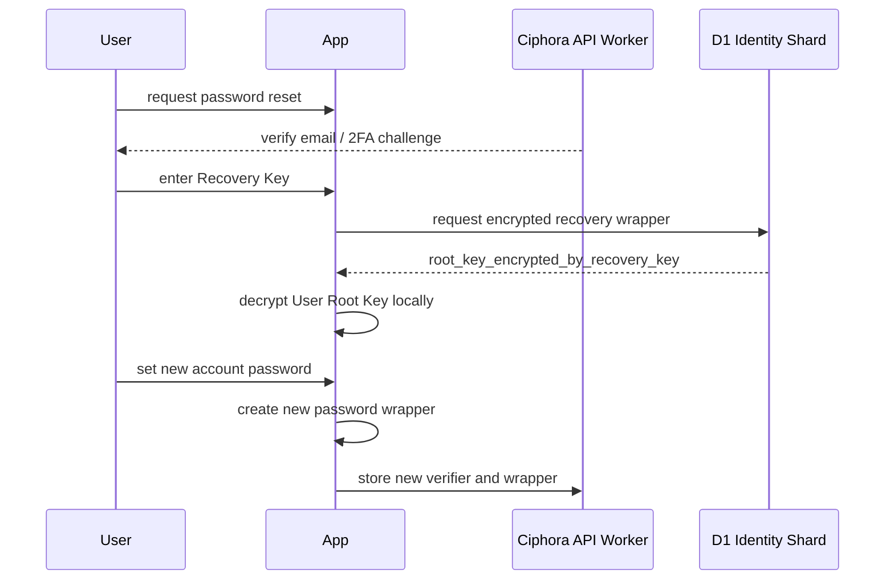
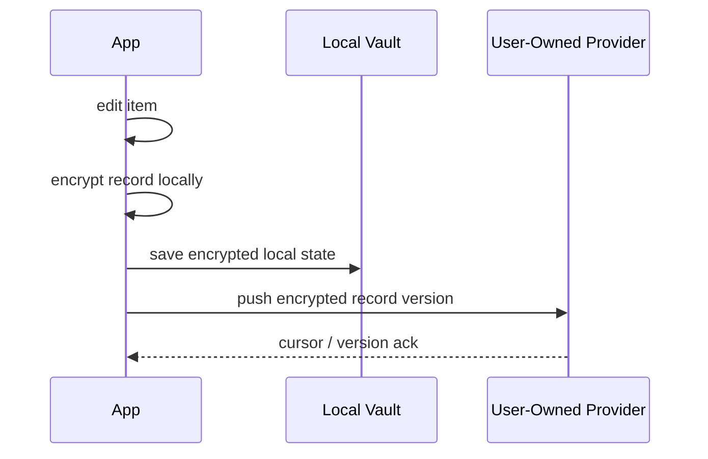

# Ciphora Architecture

This document describes the target Ciphora architecture for the planned account
and bring-your-own-database sync system.

Status: target design with backend foundation, account control-plane
foundation, user-owned Turso sync with safer manual merge semantics, user-owned
D1 Bridge sync shipped, and advanced user-owned D1 Direct sync shipped.

The current shipped app still uses an encrypted browser-local vault for actual
vault data. Backend foundation work now exists for the control plane: 10 D1
databases are provisioned and bound, base D1 schemas are applied, a Turso
archive schema is migrated, Pages Functions expose safe health endpoints, and
the first account control-plane foundation is deployed. Frontend account UI,
OPAQUE-backed signup/login for new accounts, challenge-bound login proof as a
legacy verifier fallback, logged-in
password change, Recovery Key setup, encrypted sync profile save/read/disable,
provider connection checks, hardened manual Turso sync with
delta-safe push/pull reconciliation, manual D1 Bridge sync, advanced manual D1
Direct sync, a deployable user-owned D1 Bridge worker template, account-backed fresh-device Turso/D1 Bridge/D1 Direct restore,
a browser-local provider migration wizard, and a Recovery Key forgot-password
ceremony are shipped; email verification and email-token-gated Recovery Key
reset are now wired through Brevo+Resend, while incremental conflict-aware sync is
still planned follow-up work.

---

## Architecture Summary

Ciphora should become a local-first, zero-knowledge password manager with an
internal identity control plane and user-owned vault storage.

Core principle:

```text
Ciphora owns account identity.
The user owns vault storage.
Ciphora never sees plaintext vault data or plaintext user database tokens.
```

Final target:

```text
Frontend:          Cloudflare Pages / PWA
API:               1 Cloudflare Worker
Internal DB:        10 Cloudflare D1 databases
Internal archive:   1 Turso database
Vault sync:         User-owned Turso, user-owned D1 through a sync bridge, or advanced D1 Direct
Object storage:     none in v1
Canonical vault:    encrypted records only
```

R2 is intentionally out of scope for v1. KV is not a canonical vault store.
Attachments and file blobs are disabled until a storage model is chosen.

---

## High-Level Diagram



---

## Design Goals

- Keep Ciphora zero-knowledge for vault content.
- Support local-only use as a first-class mode.
- Let users bring their own database for sync.
- Keep Ciphora's internal database limited to identity and control-plane data.
- Avoid provider lock-in by using a canonical sync protocol and adapters.
- Avoid storing plaintext user database credentials on Ciphora servers.
- Keep backend scaling simple: one directory DB, eight identity shards, one ops DB.
- Keep Turso internal usage non-critical so login does not depend on it.

---

## Deployment Units

### Ciphora Frontend

Current:

- React 18
- TypeScript
- Vite
- Tailwind CSS
- React Router
- Web Crypto
- Cloudflare Pages static hosting

Responsibilities:

- unlock and encrypt/decrypt vault data locally
- manage local encrypted vault state
- manage setup, import, export, and quick unlock
- call Ciphora API Worker for account and encrypted sync profile data
- call the shipped Turso, D1 Bridge, and advanced D1 Direct sync adapters directly from the browser
- later, add incremental sync maturity

### Ciphora API Worker

Foundation implemented through Cloudflare Pages Functions. Account signup/login,
OPAQUE-backed signup/login for new accounts, challenge-bound verifier fallback, session,
logged-in password change, Recovery Key setup, Recovery Key
forgot-password reset, and encrypted sync profile storage endpoints are
deployed. Provider connection checks, manual Turso sync, manual D1 Bridge
sync, advanced manual D1 Direct sync, and account-backed fresh-device Turso/D1 Bridge/D1 Direct restore now run
client-side. Email verification and email-token-gated Recovery Key reset are
deployed through Brevo+Resend-backed Pages Functions with ops-runtime D1 daily
provider quota counters.

Responsibilities:

- account signup and login (foundation implemented)
- OPAQUE signup/login for new accounts using a vetted browser/Worker-capable
  package, plus challenge-bound verifier fallback for legacy accounts
- session lifecycle (foundation implemented)
- recovery-key setup/rotation (foundation implemented)
- recovery-key forgot-password reset (foundation implemented)
- encrypted sync profile storage (foundation implemented)
- email verification (foundation implemented) and email change
- password change (logged-in foundation implemented), email-backed reset (foundation implemented), and account recovery metadata
- device registry
- identity shard routing
- rate limiting and abuse checks
- audit/event outbox

The API Worker must never decrypt vault items or user database tokens.

### Internal D1 Databases

Foundation implemented.

Use all 10 D1 slots as an internal control plane:

```text
D1 #1  ciphora_directory
D1 #2  ciphora_identity_00
D1 #3  ciphora_identity_01
D1 #4  ciphora_identity_02
D1 #5  ciphora_identity_03
D1 #6  ciphora_identity_04
D1 #7  ciphora_identity_05
D1 #8  ciphora_identity_06
D1 #9  ciphora_identity_07
D1 #10 ciphora_ops_runtime
```

`ciphora_directory` is the router database:

- normalized email hash
- user id
- identity shard id
- account status
- created timestamp

`ciphora_identity_00..07` store user control-plane records:

- users
- auth verifiers
- KDF params
- encrypted root-key wrappers
- recovery verifiers
- encrypted sync profiles
- devices
- sessions
- recovery metadata
- account settings

`ciphora_ops_runtime` stores short-lived operational state:

- email verification tokens
- password reset challenges
- rate limit counters
- short audit events
- job outbox
- future sync health and audit metadata if needed

### Internal Turso Database

Foundation implemented.

Use one Turso database as non-critical archive/reporting storage:

```text
Turso #1 ciphora_archive
```

Responsibilities:

- long-retention audit archive
- email delivery history
- privacy-safe usage aggregates
- operational reports
- non-critical debugging metadata

Rule: Turso archive must not be required for login or vault unlock. If Turso
archive is unavailable, core account flows should continue.

### User-Owned Sync Providers

Partially implemented.

Ciphora supports the following storage modes:

```text
Local Only
Sync to My Turso
Sync to My D1 Bridge
Sync to My D1 Direct
```

Provider responsibilities:

- store encrypted vault records
- store encrypted record versions
- store tombstones for deletes
- store sync cursors
- optionally store provider-local device metadata

Ciphora does not own this storage. The user owns the provider account,
database, credentials, retention, and provider billing.

Current shipped slice:

- manual Turso push/pull from Settings when an active encrypted Turso sync
  profile exists
- browser-side schema bootstrap using `schema/turso/user_vault.sql`
- local encrypted vault state now keeps provider-aware sync metadata for
  known-remote records and pending local deletes
- stale pushes refresh remote state first, then only changed logical items
  create fresh remote record versions
- push only tombstones remote records that the current browser previously knew
  about and deleted locally
- per-record remote version history is pruned to keep the newest 8 versions
- pull merges remote records into the local vault, applies safe remote
  deletes, and preserves unseen local items; local activity history stays local
- `/vault/unlock` can restore a fresh browser from a Ciphora account plus the
  active encrypted Turso sync profile without retyping provider credentials
- manual D1 Bridge push/pull from Settings when an active encrypted D1 Bridge
  sync profile exists
- browser-side schema bootstrap for D1 Bridge using `schema/d1/user_vault.sql`
  through the user-owned Worker bridge
- a deployable bridge template now lives in `templates/d1-bridge/` and exposes
  `/health`, `/schema/apply`, `/records`, and `/sync/push` behind Bearer auth
- `/vault/unlock` can now restore a fresh browser from an active encrypted D1
  Bridge sync profile without re-entering provider credentials
- manual D1 Direct push/pull from Settings when an active encrypted D1 Direct
  sync profile exists; this uses Cloudflare's D1 REST query API directly from
  the browser, so it is advanced and D1 Bridge remains the recommended D1 path
  for non-technical users and tighter token isolation
- `/vault/unlock` can now restore a fresh browser from an active encrypted D1
  Direct sync profile without re-entering provider credentials, if the browser
  can reach the Cloudflare D1 REST API
- Settings now also exposes a provider migration wizard across Turso, D1
  Bridge, and D1 Direct handoff; the browser refreshes the source snapshot, verifies the
  target provider is empty, copies the encrypted snapshot, verifies item
  counts, then switches the active encrypted sync profile without storing two
  active providers on Ciphora
- `/vault/unlock` now also exposes an email-backed forgot-password Recovery
  Key ceremony: the browser first requests a generic reset email, opens the
  short-lived inbox token, derives a recovery verifier locally, decrypts the
  stored recovery wrapper locally, uploads a replacement password verifier
  plus password wrapper, and immediately regains an account session without
  revealing the Recovery Key or root key to Ciphora

---

## BYODB Provider Model

The app should use a provider adapter contract instead of hardcoding one
database model into the product.

Target adapter interface:

```ts
interface SyncProvider {
  testConnection(): Promise<SyncHealth>;
  ensureSchema(): Promise<void>;
  pull(cursor: string | null): Promise<SyncPullResult>;
  push(batch: EncryptedSyncBatch): Promise<SyncPushResult>;
  rotateCredentials(nextConfig: EncryptedProviderConfig): Promise<void>;
}
```

Provider modes:

| Mode | Target | Credential handling | v1 recommendation |
| --- | --- | --- | --- |
| `local_only` | browser-local encrypted vault | no remote credential | ship first |
| `external_turso` | user Turso DB | encrypted sync profile | first BYODB provider |
| `external_d1_bridge` | user Worker + D1 binding | encrypted sync endpoint/token | second BYODB provider |
| `external_d1_direct` | Cloudflare D1 REST query API | encrypted Cloudflare token | advanced option; D1 Bridge remains recommended |
| `external_tidb_bridge` | user TiDB-backed HTTP bridge | encrypted sync endpoint/token | bridge-compatible provider |
| `external_cockroach_bridge` | user CockroachDB-backed HTTP bridge | encrypted sync endpoint/token | bridge-compatible provider |
| `external_aiven_bridge` | user Aiven PostgreSQL-backed HTTP bridge | encrypted sync endpoint/token | bridge-compatible provider |
| `external_supabase_bridge` | user Supabase Edge Function/HTTP bridge | encrypted sync endpoint/token | bridge-compatible provider |
| `external_mongodb_bridge` | user MongoDB Atlas-backed HTTP bridge | encrypted sync endpoint/token | bridge-compatible provider |
| `external_firestore_bridge` | user Firebase Firestore-backed HTTP bridge | encrypted sync endpoint/token | bridge-compatible provider |

Current shipped adapter maturity:

- `external_turso`: `testConnection`, schema bootstrap, safer manual `push`,
  pull-if-stale-before-push, delta-only manual `push` with bounded version
  pruning, merge-safe manual `pull`, and account-backed fresh-device restore
  run in the browser.
- `external_d1_bridge`: encrypted profile storage, authenticated health
  checks, schema bootstrap, safer manual `push`, pull-if-stale-before-push,
  delta-only manual `push` with bounded version pruning, merge-safe manual
  `pull`, account-backed fresh-device restore, and a deployable user-owned
  Worker template are shipped.
- `external_*_bridge`: TiDB, CockroachDB, Aiven PostgreSQL, Supabase,
  MongoDB Atlas, and Firebase Firestore are wired as Ciphora HTTP Bridge
  compatible providers. They reuse the same encrypted bridge sync runtime as
  D1 Bridge when the user supplies a bridge that implements `/health`,
  `/schema/apply`, `/records`, and `/sync/push`. Provider-specific bridge
  templates remain separate follow-up work.
- `external_d1_direct`: encrypted profile storage, client-side REST query
  connection check, schema bootstrap, safer manual `push`, pull-if-stale-before-push,
  delta-only manual `push` with bounded version pruning, merge-safe manual
  `pull`, smart auto-sync, provider migration, and account-backed fresh-device
  restore are shipped as an advanced mode.

Current shipped sync operating model:

- one active encrypted sync profile per account; saving a new active provider
  disables the previous active profile
- browser-local encrypted vault remains the canonical working state during
  normal use
- provider sync currently acts as encrypted replication plus fresh-device
  restore, not as a replacement for local vault storage
- manual push/pull remain available from Settings, and a browser-local
  smart-auto-sync layer can also pull on app focus plus debounce push after
  local drift while the vault, account session, sync profile, and active tab
  prerequisites are satisfied
- before a stale push, the browser refreshes remote state first; only logical
  item deltas create fresh remote versions, and each record keeps a bounded
  local-first version tail on the provider
- a local delete becomes a pending local tombstone first; the remote delete is
  only applied on a later push and only for records that browser already knows
  belong to that provider snapshot
- pull merges remote active records into local state and preserves unseen local
  items; activity log history remains local-only
- disconnect is now an explicit ceremony: the user can either disable the
  encrypted sync profile only, or clean up only the remote records already
  known by that browser before the profile is disabled and local sync metadata
  is reset; unseen remote records are preserved until a browser pulls them
- the active encrypted sync profile can now be decrypted locally on demand into
  the Settings form so provider endpoint/token rotation stays browser-local and
  does not require manual re-entry from scratch
- provider migration is now a shipped browser-local ceremony: the target
  provider must be empty, the source snapshot is refreshed first, target counts
  are verified after copy, and only then does Ciphora replace the one active
  encrypted sync profile; the old source provider is left untouched in this v1
  handoff

Recommended v1 maturity direction:

| Mode | Meaning | Recommendation |
| --- | --- | --- |
| `local_only` | browser-only encrypted vault with no provider | keep as the default baseline |
| `connected_sync` | local-first vault plus one active provider profile | target steady-state sync mode |
| `provider_migration` | temporary controlled move between providers | shipped as an empty-target guided workflow; keep improving cleanup/history, not dual-write |

Rules for the maturity path:

- do not ship dual-active Turso plus D1 Bridge sync before the single-provider
  model has mature sync status, auto-sync, and conflict visibility
- add automatic sync only on top of `connected_sync`, with pending-change
  visibility, pause/failure states, and a kill switch
- treat provider migration as an explicit ceremony: verify counts, switch the
  active profile, then offer optional cleanup of the old remote dataset

D1 should usually use a sync bridge:

```text
Ciphora App -> User Sync Bridge Worker -> User D1 binding
```

This avoids putting broad Cloudflare API credentials directly into the browser
and matches how D1 is normally consumed from Workers bindings.

D1 Direct exists for advanced BYODB users who understand that the Ciphora
server still stores only encrypted provider-config ciphertext, but the unlocked
browser runtime must decrypt and use the Cloudflare API token while syncing.
Use the narrowest Cloudflare token possible and prefer D1 Bridge when browser
CORS or token-exposure risk is not acceptable.

Turso may support a direct advanced mode because its database URL and database
token model is simpler:

```text
Ciphora App -> User Turso database
```

Even in direct mode, Turso credentials must be stored only inside an encrypted
sync profile.

---

## Key And Crypto Model

The key model must separate login recovery from vault recovery.

```text
Account password
  - used for login and to derive a wrapping key
  - can be changed
  - can be reset for account access only

User Root Key
  - random 256-bit secret generated client-side
  - decrypts vault key material and encrypted sync profile
  - never known by Ciphora server

Recovery Key
  - generated client-side
  - shown once in an Emergency Kit
  - used to recover the User Root Key if password is forgotten
  - never known by Ciphora server

Encrypted Sync Profile
  - contains provider type and provider credentials
  - encrypted client-side by the User Root Key
  - stored by Ciphora only as ciphertext
```

Server-side stored wrappers:

```text
root_key_encrypted_by_password_key
root_key_encrypted_by_recovery_key
sync_profile_encrypted_by_root_key
```

The server may store verifier/KDF metadata for legacy authentication and OPAQUE
registration records for new accounts, but it must not store the account
password, master password, root key, recovery key, plaintext sync profile,
plaintext database token, or plaintext vault item. New OPAQUE accounts use an
OPAQUE export-key-derived password wrapper; legacy verifier records use a
signed login challenge and browser-derived HMAC proof so normal login no longer
submits only a reusable static verifier.

---

## Data Flows

### Signup And First Vault Setup



### Login On Existing Device



### New Device Restore



If the encrypted sync profile is recoverable, the user does not need to type
their Turso/D1 credentials again on every new device.

Current shipped build now completes this flow for active Turso, D1 Bridge, and D1 Direct
sync profiles: the browser logs into Ciphora, decrypts the password root-key
wrapper locally, decrypts the encrypted sync profile locally, pulls the
encrypted provider snapshot, and installs a new wrapped local master-password
auth record on the fresh device.

### Forgot Password With Recovery Key



If the user has no recovery key and no unlocked device, Ciphora can reset
account login identity, but it cannot recover old vault data or the old sync
profile.

### Vault Sync Write



Only encrypted records leave the device.

Current shipped Turso, D1 Bridge, and D1 Direct sync are still local-first
snapshot/delta sync rather than background incremental sync. Push only applies known safe deletes, pull merges
remote records into the local vault instead of hard-replacing it, and the
local activity log remains browser-local.

---

## Internal Identity Sharding

The directory database is the only lookup table needed before knowing a user
shard.

```text
email -> normalize -> hash -> ciphora_directory -> user_id + shard_id
```

Rules:

- one user belongs to exactly one identity shard
- do not split one user across D1 and Turso
- do not query all shards during login
- shard id is assigned at signup and stored in the directory
- user migration between shards must be a background migration, not a runtime
  fallback
- directory records must be small and indexed

The eight identity shards use the same schema.

---

## Planned Internal Schemas

### Directory DB

Suggested tables:

```text
directory_users
directory_email_aliases
directory_shard_health
directory_migrations
```

### Identity Shards

Suggested tables:

```text
users
auth_verifiers
user_kdf_params
root_key_wrappers
sync_profiles
devices
sessions
recovery_metadata
account_events
```

### Ops Runtime DB

Suggested tables:

```text
email_verification_challenges
password_reset_challenges
rate_limit_buckets
job_outbox
short_audit_events
provider_health_checks
```

### Turso Archive

Suggested tables:

```text
audit_archive
email_delivery_archive
ops_metrics_daily
privacy_safe_usage_daily
incident_notes
```

### User-Owned Vault DB

Suggested canonical schema:

```text
vault_records
vault_record_versions
vault_tombstones
sync_cursors
provider_devices
schema_migrations
```

All user-owned vault rows should store ciphertext and minimal routing metadata.
Do not store plaintext usernames, passwords, notes, card numbers, TOTP secrets,
or provider tokens.

---

## Security Boundaries

Must never be visible to Ciphora server:

- account password
- master password
- User Root Key
- Recovery Key
- plaintext vault item
- plaintext TOTP secret
- plaintext card number
- plaintext secure note
- plaintext user database token

May be visible to Ciphora server:

- account email or normalized email hash, depending on feature need
- account status
- auth verifier
- KDF params
- device metadata
- session metadata
- encrypted root-key wrappers
- encrypted sync profile
- operational audit metadata

The sync provider may see:

- encrypted vault records
- sync cursors
- tombstones
- schema version
- record ids
- timestamps needed for sync

The sync provider must not see:

- plaintext vault content
- plaintext recovery key
- plaintext account password

---

## Failure Modes

| Failure | Expected behavior |
| --- | --- |
| Turso archive down | login and vault unlock continue; archive jobs retry later |
| one identity shard down | only users on that shard are affected |
| directory DB down | login/signup cannot resolve users |
| user-owned DB down | local vault stays usable; sync pauses |
| sync token rotated | user reconnects provider or uses recovered encrypted profile if still valid |
| password forgotten, recovery key available | user resets password and keeps vault access |
| password forgotten, recovery key lost, no unlocked device | old vault cannot be recovered |

---

## Roadmap

### Phase 0 - Current Runtime

- static Cloudflare Pages app
- browser-local encrypted vault
- encrypted export/import including fresh-browser pre-unlock restore
- quick unlock wrapper
- Settings account onboarding/login/logout wired to the deployed auth API
- Settings Recovery Key setup/rotation wired to the deployed recovery API
- Settings encrypted sync profile save/disconnect wired to the deployed sync-profile API
- Settings can now load the active encrypted sync profile back into the edit form locally for provider rotation without exposing plaintext config to Ciphora
- Settings can now run a provider migration wizard that requires an empty target, copies the encrypted snapshot, verifies item counts, and then switches the active sync profile
- Settings provider connection checks wired for Turso direct SQL ping, D1 Bridge health checks, and advanced D1 Direct REST query ping
- Settings Sync Status Center wired from local sync metadata so users can see the current local-first mode, pending local changes, and known provider snapshot state
- Settings smart auto-sync wired from local browser state with an explicit kill switch, pause/error state, pull-on-focus, and debounced push after local changes
- Settings disconnect ceremony wired so users can choose disconnect-only or known-remote cleanup before the encrypted sync profile is disabled
- Settings manual Turso sync wired for encrypted push/pull, stale-remote refresh before push, delta-only writes, safe known-delete tombstones, bounded version history, and merge-safe pull semantics
- Settings manual D1 Bridge sync wired for encrypted push/pull through the user-owned Worker bridge with the same stale-refresh, delta-write, bounded-version, and safer merge/tombstone semantics
- Settings manual D1 Direct sync wired for encrypted push/pull through Cloudflare's D1 REST query API with the same stale-refresh, delta-write, bounded-version, and safer merge/tombstone semantics
- `/vault/unlock` account-backed fresh-device Turso/D1 Bridge/D1 Direct restore shipped for active encrypted sync profiles
- `/vault/unlock` Recovery Key forgot-password reset shipped with short-lived email reset tokens, short-lived reset challenges, and local recovery-verifier proof
- no broader background sync beyond the unlocked active tab yet

### Phase 1 - Ciphora Account Control Plane

- backend foundation: done
  - 10 D1 databases provisioned
  - base D1 schemas applied
  - Pages Functions health endpoints deployed
  - Turso archive schema migrated
- auth API foundation: done
  - signup, login metadata, login, sessions, session lookup, logout
  - encrypted root-key wrappers
  - client-side verifier and root-key wrapper generation from Settings
- recovery-key setup foundation: done
  - browser-generated Recovery Key shown once
  - recovery root-key wrapper encrypted client-side
  - recovery verifier derived client-side and stored only as a backend hash
  - `/api/recovery/status` and `/api/recovery/setup`
- Recovery Key forgot-password reset foundation: done
  - `/api/recovery/email-reset/request`
  - `/api/recovery/reset/start` and `/api/recovery/reset/finish`
  - short-lived inbox-token gate before the reset challenge is issued
  - short-lived password-reset challenges in ops runtime
  - backend verifies recovery-verifier hash before rotating account-password state
  - prior account sessions revoked and fresh session issued on success
- logged-in password change foundation: done
  - password metadata/change endpoints
  - client-side verifier and password wrapper rotation
  - old password wrappers revoked
  - other active sessions revoked
- email verification: done
  - `/api/email/verification/status`, `/api/email/verification/send`, and `/api/email/verification/confirm`
  - Brevo+Resend send links; D1 stores only email hashes, short-lived token hashes, and provider/day quota counts
- email-delivery-backed password reset: done for Recovery Key reset gate

### Phase 2 - Encrypted Sync Profile

- encrypted provider config storage: done for one active profile per account
- local decryption of the active sync profile for provider operations: done
- new-device recovery of provider config and root-key-backed local install: done for the Turso, D1 Bridge, and D1 Direct paths
- provider connection health check: done for Turso direct mode, D1 Bridge health endpoints, and advanced D1 Direct REST query ping
- no plaintext provider tokens on server

### Phase 3 - User-Owned Turso Sync

- canonical user vault schema: done for the manual Turso path
- Turso direct advanced mode: done for manual plus smart auto sync
- encrypted record push/pull: hardened local-first delta foundation done
- smart auto sync for unlocked active tabs: done
- incremental cursor sync, background sync beyond the active tab, richer conflict journal, and conflict/tombstone maturity

### Phase 4 - User-Owned D1 Sync Bridge

- deployable bridge Worker template: done
- D1 schema migration/bootstrap path: done
- bridge endpoint token model: done
- manual app-to-bridge encrypted push/pull with bounded version pruning: done
- broader sync maturity: follow-up

### Phase 4b - User-Owned D1 Direct

- Cloudflare D1 REST query endpoint mode: done as an advanced option
- encrypted Cloudflare token in sync profile: done
- manual and smart auto-sync encrypted push/pull: done
- account-backed fresh-device restore: done when browser/API access succeeds
- D1 Bridge remains recommended for safer token isolation and non-technical users

### Phase 5 - Account Recovery And Migration Maturity

- recovery key rotation
- provider migration
- provider credential rotation
- account deletion and data export guarantees

### Phase 6 - Shared Vaults

- public/private key model
- wrapped collection or item keys
- org membership
- invite and revocation flows

Shared vaults must not be added until the single-user key model is stable.

---

## Capacity Notes

Planning assumptions as of 2026-04-23:

- D1 Free has 10 databases per account, 500 MB per database, and 5 GB total
  storage.
- D1 is designed for horizontal scale across smaller databases.
- Turso Free currently lists 100 databases, 5 GB storage, 500M monthly row
  reads, and 10M monthly row writes.

These numbers are provider policy, not application guarantees. Re-check the
official provider docs before provisioning production infrastructure.

References:

- Cloudflare D1 limits: https://developers.cloudflare.com/d1/platform/limits/
- Cloudflare D1 pricing: https://developers.cloudflare.com/d1/platform/pricing/
- Cloudflare D1 Worker API: https://developers.cloudflare.com/d1/worker-api/
- Cloudflare D1 proxy Worker tutorial: https://developers.cloudflare.com/d1/tutorials/build-an-api-to-access-d1/
- Turso pricing: https://turso.tech/pricing
- Turso usage and billing: https://docs.turso.tech/help/usage-and-billing
- Turso SQL over HTTP: https://docs.turso.tech/sdk/http/quickstart
- Bitwarden encryption model: https://bitwarden.com/help/what-encryption-is-used/
